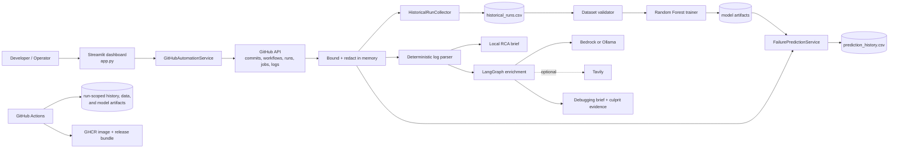

# CI Signal: Feature, Architecture, and Flow Guide

> This document is intentionally sized for approximately 7–8 pages when exported with standard margins and an 11-point body font. It explains the implemented product as of the merge into `main` at commit `41ba7f0`.

## 1. Purpose and product scope

CI Signal is a CI/CD failure-intelligence application built around one continuous loop:

**application change → pre-CI risk estimate → real CI result → root-cause analysis → verified feedback → model retraining**

The system combines three independent layers so that useful analysis does not depend on a cloud model:

1. **GitHub automation** reads repository metadata, commits, workflow definitions, workflow runs, jobs, and bounded Actions logs directly from GitHub. This removes the normal need to upload code or logs manually.
2. **Failure-risk prediction** uses genuine historical workflow outcomes and the actual files changed in a commit to estimate a failure percentage before the target CI run finishes. The model is advisory and never blocks a release.
3. **Root-cause analysis (RCA)** always offers a deterministic local parser and debugging brief. An explicitly configured AWS Bedrock or Ollama model can enrich the analysis; Tavily research is optional.

The application has three operating modes:

| Mode | External requirements | Result |
|---|---|---|
| Offline deterministic RCA | None | Parse pasted/uploaded logs locally and produce a downloadable debugging brief |
| GitHub automated service | Repository name; token for Actions logs/private repositories | Load real changes and runs, predict risk, synchronize history, and analyze the latest failed run |
| AI-enriched GitHub RCA | GitHub log access plus Bedrock or Ollama; Tavily optional | Triage, research, synthesis, code context, and deterministic culprit evidence |

Public repository metadata can be read anonymously at GitHub's lower rate limit. A fine-grained token is required for private repositories and failed-run log archives. Tokens entered in the dashboard exist only in Streamlit session state and are not saved by the application.

## 2. System architecture



### Component responsibilities

| Layer | Main implementation | Responsibility |
|---|---|---|
| Presentation | `app.py` | Seven-tab operations dashboard, readiness, forms, charts, downloads, safe errors, authentication, and session state |
| Configuration | `config.py` | Environment variables, paths, provider selection, upload/cooldown limits, password gate, and repository allowlist |
| GitHub integration | `src/integrations/github_automation.py` | Connection verification, workflow discovery, commits, runs, jobs, log download, automatic prediction inputs, and repository snapshots |
| Log/RCA tools | `src/tools/log_parser.py`, `src/analysis/local_rca.py`, `src/tools/commit_analyzer.py` | Error extraction, category mapping, deterministic guidance, and evidence-based culprit ranking |
| Enrichment graph | `src/graph/`, `src/agents/`, `src/utils/llm.py` | Supervised parse/triage/research/synthesis flow with Bedrock/Ollama and optional Tavily |
| Prediction | `src/prediction/` | Collection, leakage-safe features, validation, training, inference, evaluation, prediction history, and feedback |
| Automation | `.github/workflows/` | Advisory prediction, testing, security, container validation/publishing, feedback, and retraining |
| Deployment | `Dockerfile`, `compose.yaml` | Non-root Streamlit container, health checks, persistent runtime state, and hardened single-replica operation |

Runtime state is separated from source code:

- `data/historical_runs.csv` stores genuine completed workflow examples.
- `data/prediction_history.csv` stores predictions and eventual real outcomes.
- `models/` stores trusted binary and optional category-model artifacts plus metrics.
- `output/` stores generated reports when a CLI flow requests them.

These locations are gitignored. CSV and model metadata replacements are atomic, and prediction-history read/modify/write operations are locked within one process. This is why the supported deployment uses exactly one application replica.

The dashboard filesystem and GitHub Actions artifacts are separate execution surfaces. A running dashboard does not automatically download the model or prediction-history artifact produced by Actions; a trusted model must be copied into its `models/` storage, and any desired history must be imported or synchronized separately.

## 3. GitHub automation and ingestion flow

### Connection and repository discovery

The Automation tab accepts an exact `owner/repository` value. The value must match the syntax check and, when configured, the case-insensitive `ALLOWED_REPOSITORIES` allowlist. `GitHubAutomationService` then:

1. creates an authenticated or anonymous PyGithub client;
2. verifies the account and repository access;
3. records only safe status fields such as account login, visibility, permissions, default branch, and API-rate-limit information;
4. fetches the ten most recent commits, twenty recent runs, and actual active workflow definitions; and
5. keeps that snapshot in Streamlit session state for the repository activity tables and workflow selector.

The service can list repositories for an authenticated account, but public users can simply enter a repository name. **Refresh GitHub activity** reloads the snapshot manually; there is no background polling. **Disconnect** clears the snapshot, automatic results, and session token. This is a read-only intelligence console: it does not edit GitHub code, runs, pull requests, workflows, or repository settings.

### Automatic commit prediction

**Predict failure percentage** selects the newest commit on the target branch, loads its exact SHA and changed files, and computes features from that commit plus only earlier completed runs. If the matching target workflow has already completed, the score is clearly marked **retrospective/display-only** and is not added to feedback history. If CI has not completed, the prediction is stored so the real outcome can later close the loop.

### Automatic failed-run RCA

**Analyze latest failed run** filters by the selected workflow and deliberately finds the newest failed run even if a newer run passed. It retrieves:

- the stable run ID and SHA;
- job and step conclusions;
- the GitHub Actions log archive.

Log archives are streamed with a 2 MB default byte limit, expanded with the same safety limit, decoded safely, and redacted before use. The combined redacted text remains in memory; the dashboard path does not write raw GitHub logs to disk. Authentication tokens are private fields on the integration service and are never inserted into Pydantic output models or LangGraph state. The deterministic automatic path does not fetch source-code context or attach culprit ranking; those are enrichment features of the optional AI graph.

### History synchronization

**Sync completed workflow runs** collects up to 200 genuine, definitive `success` or failure-class runs. Product-support workflows such as Pre-CI Failure Prediction, Prediction Feedback, and Train Failure Predictor are excluded by default so one commit cannot receive contradictory labels. For every accepted run, the collector joins GitHub run metadata, exact commit changes, historical context, and—when authenticated—an optional category extracted from failed logs. The resulting dataset atomically replaces the active historical CSV.

## 4. Failure-risk prediction and learning loop

### Model inputs

The feature extractor converts every historical run and live commit through the same deterministic code path. Inputs include:

| Signal family | Examples |
|---|---|
| Change size | Files changed, lines added/deleted, number of commits |
| Change type | Dependency, CI workflow, Docker, test, and infrastructure file flags |
| File composition | Counts for Python, YAML, JSON, Terraform/HCL, Dockerfile, shell, JavaScript/TypeScript, Java/XML, Markdown, and other extensions; extension diversity |
| Prior outcomes | Previous branch-run status, recent failure count/rate over the rolling history window, and failures on the same branch/workflow |

Final-state fields—`actual_failure`, `actual_category`, `status`, `conclusion`, and `duration_seconds`—are never model features. While building a target commit's features, collection stops before that target's own run. For pull requests, Actions explicitly scores `pull_request.head.sha` rather than GitHub's synthetic merge SHA. These rules prevent outcome leakage.

### Dataset quality and training

The validator checks binary labels, timestamps, duplicate run IDs, chronological order, missing values, class balance, branches, workflows, categories, and leakage columns. Training is enabled only with at least 20 real runs, both success and failure classes, valid timestamps/labels, and no duplicate IDs.

The binary predictor is a scikit-learn pipeline with median imputation and a 300-tree `RandomForestClassifier` using balanced subsampling. Data is sorted chronologically; an approximately 80/20 holdout is chosen only when both train and holdout contain at least two examples of each outcome class. Metrics include accuracy, precision, recall, F1, ROC-AUC when available, and a confusion matrix. Artifacts and metadata are replaced atomically.

An optional failure-category classifier is trained only from labeled failed runs. It needs at least ten labeled failures, at least two categories, and a temporal training prefix containing every category. The stable taxonomy is dependency, test, build, lint, Docker, Kubernetes, infrastructure, configuration, secrets, deployment, network, permissions, or unknown.

### Inference and explanation

The predictor returns a probability, likely pass/fail result, model version, optional category, warnings, and feature signals. Risk bands are:

- **LOW:** below 45%;
- **MEDIUM:** 45% through 74.99%;
- **HIGH:** 75% or more.

The binary outcome threshold is 50%. Top signals are the model's global feature importance weighted by the current non-zero input; the UI correctly describes association rather than causality. A holdout below 20 runs or F1 below 0.5 generates an explicit experimental-quality warning, so the score is never presented as release-grade certainty.

### Feedback and retraining

A stored pre-CI prediction has a UUID, repository, workflow, GitHub run ID, full commit SHA, probability, predicted class/category, and model version. When CI finishes, feedback first matches the stable run ID and then uses exact full-SHA matching. Legacy abbreviated SHAs are supported only when unambiguous. Success/failure outcomes become binary labels; cancelled, skipped, neutral, and stale runs are recorded without falsely treating them as successes.

This produces feedback accuracy and an auditable history. Subsequent training recollects up to 500 real runs, applies the same quality gate, evaluates chronologically, and publishes a trusted model artifact for later CI and dashboard use.

## 5. Root-cause analysis features and flow

### Deterministic parser and offline RCA

The credential-free path removes ANSI codes and timestamps, identifies failed steps and non-zero exits, extracts Python stack frames and common CI diagnostics, ranks a primary error, and maps evidence to the shared failure taxonomy. It then creates conservative category-specific guidance for dependencies, tests, lint, build/configuration, secrets, network, permissions, Docker, or an unknown fallback.

The resulting `DebuggingBrief` contains severity, confidence, error type/message/category, root-cause summary and detail, affected files/components, and three prioritized fix suggestions with implementation steps and source labels. It can be downloaded as Markdown. Uploaded/pasted content is limited by `MAX_LOG_UPLOAD_BYTES` (2 MB by default), stays local, and is not sent to GitHub, Bedrock, Ollama, or Tavily.

### Optional AI-enriched RCA

AI enrichment is opt-in. `LLM_PROVIDER=none` is the default and guarantees that startup does not construct a cloud or local-model client. Other choices are:

- `bedrock`: uses the standard AWS SDK credential chain and configured Bedrock model;
- `ollama`: uses the separately running local endpoint and selected model;
- `auto`: selects a detectable AWS identity first, then an explicitly configured Ollama endpoint, otherwise no provider.

Provider readiness checks do not make billable calls. A model is invoked only after the operator starts AI-enriched analysis. Tavily is independent and optional; unavailable research returns an empty result without breaking the log/code analysis.

The LangGraph supervisor uses deterministic routing and no supervisory LLM call:

```text
redacted in-memory log
  → parse primary evidence
  → AI triage: severity, refined category, likely cause
  → research: bounded repository context + optional Tavily findings
  → synthesis: structured debugging brief
  → deterministic culprit-commit evidence
```

Each failed graph phase can retry up to three times; exhausting the budget creates an explicit failed terminal state. The GitHub token is captured by node closures rather than stored in graph state. Repository context fetches only bounded text files, priority manifests, workflow definitions, and a shallow structure; large/binary files are skipped and long content is truncated.

The culprit analyzer scores the exact failed run's commit against concrete evidence: overlap between changed files and stack traces/modules, dependency/workflow/Docker/test/infrastructure changes, the mapped failure category, and failed-step words. Its result is labeled as evidence-ranked—not proof—so it complements rather than replaces human review or `git bisect`.

## 6. Dashboard feature walkthrough

The Streamlit interface uses a readable light content theme, dark high-contrast hero/sidebar areas, responsive wide layout, clear disabled-state explanations, safe redacted errors, and action cooldowns. An optional shared password protects the entire console.

| Area | Implemented features |
|---|---|
| **Sidebar** | Repository selection; offline/GitHub/AI/Tavily status; functional shortcut to Automation; connected identity; version and single-replica notice |
| **Automation** | Session-only token; connect/refresh/disconnect; real workflow selector; recent commit/run tables; latest-change risk; latest-failure RCA; history sync; automatic result panels |
| **Overview** | Historical-run count, observed failure rate, model readiness, feedback accuracy, capability/readiness table, current product-loop scope, daily outcome and workflow summaries |
| **Analytics** | Real-data-only failure-rate trend, recorded prediction-risk trend, failure categories, change-size exposure, and recent live or synchronized workflow signal; honest empty states when data is absent |
| **Failure analysis** | Automatic GitHub RCA result, AI-enriched GitHub RCA, or advanced local paste/upload analysis; sample/clear actions; parser evidence; downloadable brief |
| **Risk lab** | Manual scenario scoring without polluting feedback; or confirmed pre-CI GitHub commit scoring; probability, risk, outcome/category, warnings, top factors, and all feature signals |
| **Data & model** | Artifact locations/status; CSV upload and inspection (25 MB UI limit); atomic dataset activation; GitHub collection (20–500 runs); validation report; temporal training/evaluation; model metrics |
| **Feedback** | Recorded/correct prediction counts, feedback accuracy, recent outcome table, and prediction-history CSV download |

Buttons are enabled only when their prerequisites exist. For example, automated prediction needs a connected repository and valid model; log RCA needs authenticated Actions-log access; training needs a dataset that passes the quality gate; and AI analysis needs both log access and a ready provider. Every disabled action displays the missing requirement rather than failing silently.

GitHub connection/activity refreshes only when requested. The manual Risk Lab scenario is never recorded; the GitHub-commit form records only after the user confirms that the target workflow is incomplete, while automatic latest-change scoring verifies completion itself. The Feedback tab observes and exports outcomes recorded by automation—it has no manual outcome-entry control. Analytics uses a ten-run rolling failure rate, genuine stored pre-CI probabilities, categorized failures, and change-size bands; sample or retrospective data never fills missing charts.

The same prediction capabilities are available through `python -m src.prediction.cli` commands: `collect`, `inspect`, `train`, `evaluate`, `predict`, and `feedback`. `python -m src.main owner/repo` runs the RCA-oriented CLI. A guarded training-data generator can plan and dispatch real success/failure workflow scenarios, resume recorded runs, enforce a default 50-run maximum, and clean up only its recorded `ml-data/` branches; it never writes fabricated labels into the training CSV.

## 7. GitHub Actions, release, and deployment flow

### Main CI/CD pipeline

The `CI/CD Pipeline` runs on pull requests to `main`, pushes to `main`, and manual dispatch. Optional AI providers are forced to `none` in CI, so validation cannot incur an external-model charge.

```text
Exact-commit advisory prediction (non-gating)
                  │
Lint + compile ──→ Unit tests ──→ Prediction/provider tests
                                      ├─→ App build/import validation ─┐
                                      └─→ Dependency security audit ───┤
                                                                        ↓
                                                          Docker build + health
                                                                        ↓ main only
                                                   GHCR publish + release bundle
```

| Job | What it proves |
|---|---|
| Predict Failure Risk | Restores the newest trusted model/history, scores the real SHA, writes a job summary, and uploads an immutable run-linked snapshot; errors remain advisory |
| Lint & Static Checks | `ruff` and `compileall` pass |
| Unit Tests | Full pytest suite and coverage artifact pass |
| Prediction Module Tests | Feature, training, prediction, feedback, GitHub Actions helper, Bedrock/Ollama/provider boundaries pass |
| Build / App Validation | Project compiles and imports with all credentials empty |
| Dependency Security Check | `pip-audit` passes and uploads its JSON report |
| Docker Build & Validate | Image builds and Streamlit answers `/_stcore/health` from a running container |
| Publish Dashboard Image | On `main`, publishes GHCR tags `latest` and commit-addressed `sha-<12>` plus a reported image digest using the short-lived workflow token |
| Release Artifact | On `main`, validates and uploads a 30-day self-hosting bundle containing source, Docker/Compose, Streamlit config, environment template, README, and deployment guide |

After each CI completion, `feedback.yml` serializes history updates with a repository-wide non-cancelling concurrency lock. It downloads that exact CI run's immutable prediction snapshot, merges it with the latest finalized history, removes duplicate prediction IDs, records the actual outcome by run ID, and publishes a 90-day `prediction-history` artifact.

`train-model.yml` runs after completed main CI/controlled-failure runs, weekly on Monday at 06:00 UTC, or manually. It collects real history, reports dataset quality, trains only when the gate passes, evaluates, and uploads the model plus auditable dataset/reports for 90 days. `test-failure.yml` is manual development tooling that creates genuine lint, test, build, dependency, or Docker failures without directly modifying the dataset.

### Runtime deployment

The Docker image uses Python 3.11 slim, installs pinned requirements, runs Streamlit as a non-root `appuser`, exposes port 8501, and includes a health check. Compose is intended to add a restart policy, a read-only root filesystem, dropped Linux capabilities, `no-new-privileges`, a bounded `/tmp`, and persistent named volumes for `data`, `models`, and `output`. It supports host Ollama through `host.docker.internal`.

The local deployment is a real running application but stops when its host laptop or server stops. GHCR publishing produces a deployable image, not an always-on managed-cloud rollout. A permanent deployment must pin the published digest (a tag alone can be moved) on a host that supports Streamlit WebSockets, HTTPS, one replica, the three persistent mounts, runtime secrets, and the `/_stcore/health` probe.

## 8. Security, configuration, limitations, and verified state

### Security and privacy controls

- `APP_PASSWORD` adds a constant-time shared-password gate; `ALLOWED_REPOSITORIES` constrains GitHub-backed operations to exact repositories.
- GitHub tokens are session-only or deployment-injected, never displayed, serialized in result models, or stored in graph state. Fine-grained Contents/Actions read permissions are sufficient for analysis.
- Logs and commit patches are redacted for common tokens, passwords, authorization headers, private keys, and sensitive URL/query values. User-facing exception text is also redacted and length-bounded.
- Downloads and expanded log archives have explicit byte limits. Code-context files have size/content limits. External operations have cooldowns and provider calls use bounded retry/backoff.
- CI uses job-scoped permissions: read-only by default, `actions: read` for artifacts/history, and `packages: write` only for GHCR publishing.
- Public deployment must additionally use TLS and preferably an identity-aware proxy/VPN. The built-in password is not SSO.

### Main configuration

| Capability | Variables |
|---|---|
| GitHub | `GITHUB_ACCESS_TOKEN`, `DEFAULT_REPOSITORY`, `ALLOWED_REPOSITORIES` |
| AI provider | `LLM_PROVIDER`, `AWS_REGION`, `BEDROCK_MODEL_ID`, AWS identity variables/profile, or `OLLAMA_BASE_URL`, `OLLAMA_MODEL`, timeout |
| Research | `TAVILY_API_KEY` |
| Dashboard safety | `APP_PASSWORD`, `ANALYSIS_COOLDOWN_SECONDS`, `MAX_LOG_UPLOAD_BYTES` |
| Persistence | `DATA_DIR`, `MODELS_DIR`, `OUTPUT_DIR` |

All integrations are optional for startup. The Streamlit health endpoint proves process liveness only; it does not prove GitHub log permissions, model availability, provider access, or Tavily connectivity.

### Limitations and correct interpretation

The Random Forest is a baseline whose usefulness depends on varied real history. Below about 50 runs, expect weak signal; class imbalance makes precision, recall, and F1 more meaningful than accuracy. The current model must remain advisory until its chronological holdout is strong. Category prediction may stay unavailable when too few failed runs have reliable labels. Runtime CSV locking supports one process only. Culprit ranking and LLM conclusions remain hypotheses requiring human verification. Actions keeps model/history artifacts for 90 days and the release bundle for 30 days, so artifact-only continuity can expire.

Two deployment acceptance items remain. First, the current startup configuration creates a `tests/` directory, while the Docker build excludes that directory and Compose makes the root filesystem read-only; a fresh hardened Compose container may therefore fail until directory initialization or the image layout is corrected and then tested. Second, `.streamlit/secrets.toml` is gitignored but not explicitly excluded from the Docker build context, so local image builders must keep it absent and inject secrets at runtime. Current security automation covers linting, tests, dependency audit, and container startup; it does not yet provide a dedicated secret scan, SAST, container-CVE scan, SBOM, image signing, or provenance attestation.

At the time of this document, the merged implementation had passed 142 local tests plus lint, compile, dependency audit, browser/UI, Docker build, and container-health validation. The first post-merge main pipeline also completed successfully, including GHCR publishing and release-bundle creation; its Prediction Feedback and Train Failure Predictor follow-up workflows completed successfully. Operational work beyond the repository is limited to rotating any exposed credentials, supplying optional provider/model configuration, accumulating more real CI history, and choosing an always-on hosting platform if a public URL is required.
